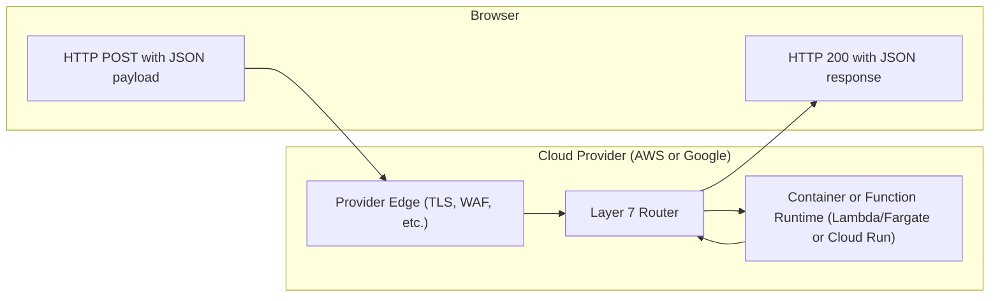

Example of a very simple Go webserver running in a cloud vendor

Originally from <https://blog.john-pfeiffer.com/go-faas-with-aws-lambda/>

# Local Dev

## Build

    go mod init github.com/johnpfeiffer/aws-go-lambda
    go mod tidy
    go build

*compiles a binary file "aws-go-lambda" that executes on apple silicon, for linux: GOOS=linux GOARCH=amd64 go build -v*

### To run locally on port 8080

 `./aws-go-lambda`

# Testing

`go test -v`

    === RUN   TestHandler
    --- PASS: TestHandler (0.00s)
    === RUN   TestGenericHandler_HTTP
    --- PASS: TestGenericHandler_HTTP (0.00s)
    PASS
    ok  	github.com/johnpfeiffer/aws-go-lambda	0.218s

`curl localhost:8080`

`curl -s -X POST localhost:8080 -H 'Content-Type: application/json' -d '{"value":"world"}'`

# Deploy

If built into a .zip that can be uploaded to AWS S3 and used for an AWS Lambda

Otherwise leveraging GitHub and Google Cloud integration to auto deploy

# Architecture

## Request



    POST / HTTP/1.1
    Host: <hostname>
    Content-Type: application/json
    {"value":"world"}


<https://docs.github.com/en/get-started/writing-on-github/working-with-advanced-formatting/creating-diagrams>

Mermaid version:
```mermaid
  info
```
